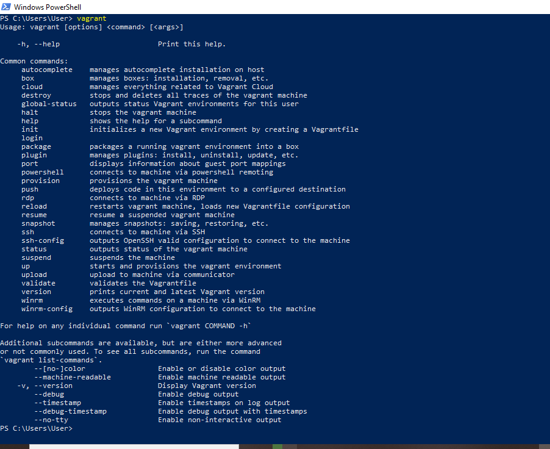
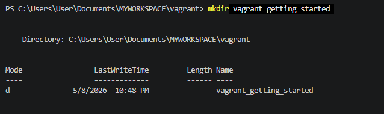
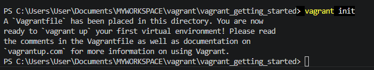
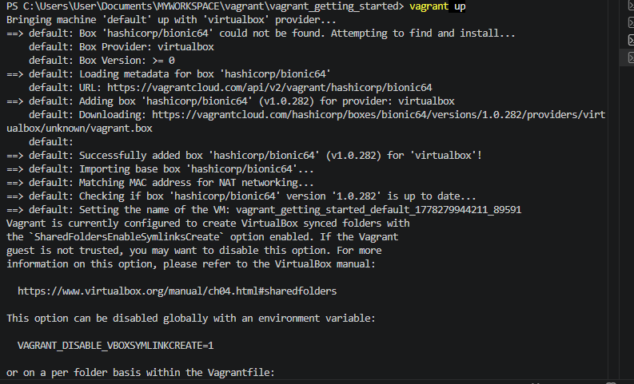
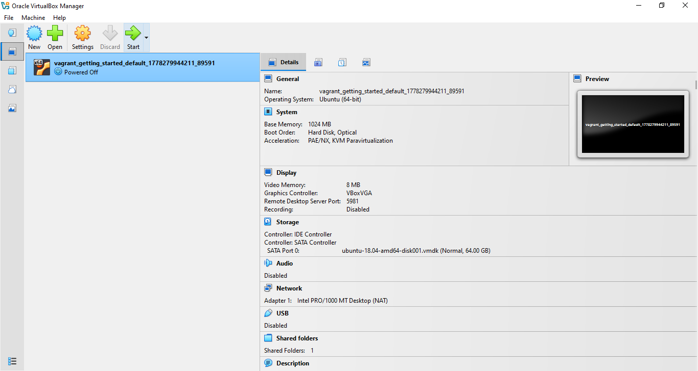
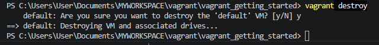
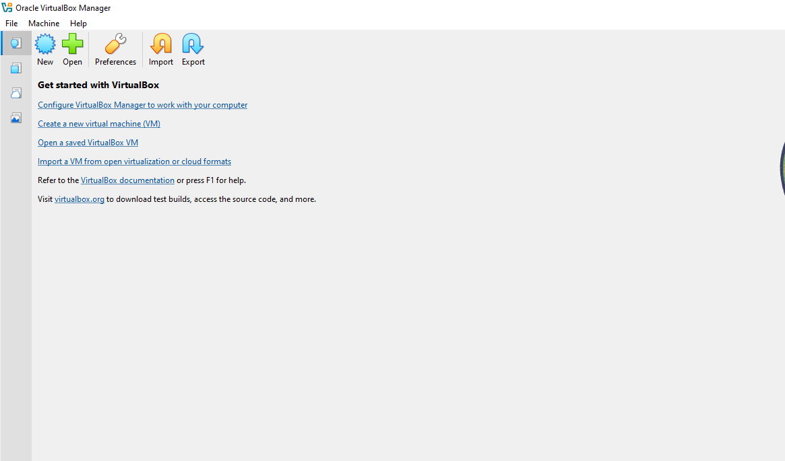

### Virtual machine Lab Guide Project 

**1. Installation**
* Visit the Vagrant Downloads Page to download vagrant and install
  
**2. Verify the Installation**
* Open Command Prompt or Terminal
* Check Vagrant Installation
  * Type the following command and press Enter: vagrant
  * Expected Output: 
  You should see a list of Vagrant commands 
  

**3. Create a Directory for Your 
project**

**Create a New Directory:**
* Use the following command to create a new directory named vagrant getting started: 

Run mkdir vagrant_getting_started

**Output**

**Navigate into Your New Directory:**
* Change into your newly created directory with: 

* Run cd vagrant_getting_started

**4. Initialize the Vagrant Project**

* Run the following commands:
vagrant init

**Output**

**5. Configure Your Vagrantfile**

To set up your virtual machine, you need to specify which base box to use in your Vagrantfile.

* Open the Vagrantfile:

* Use VSCode text editor to open the Vagrantfile.
  
* Modify the Vagrantfile:

* Replace the existing contents with the following code:

"Vagrant.configure("2") do |config|

config.vm.box = "hashicorp/bionic64"

end"

**Explanation:** The line config.vm.box = "hashicorp/bionic64" tells Vagrant to use the hashicorp/bionic64 box as the base for your virtual machine

**6. Start Your Virtual Machine**

* Run the Command in the terminal:
vagrant up

Output 1

**Newly created virtual machine

**Accessing the Virtual Machine:**

Run vagrant ssh

**7. Stopping and Destroying the Virtual Machine**

* To Stop the Virtual Machine:
    Run vagrant halt
   
* To Completely Remove the Virtual Machine:
    Run  vagrant destroy

Output

